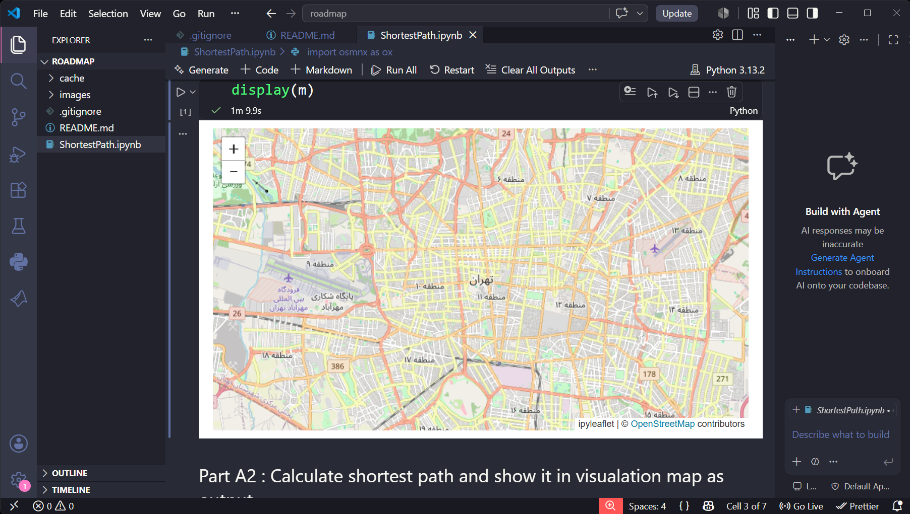
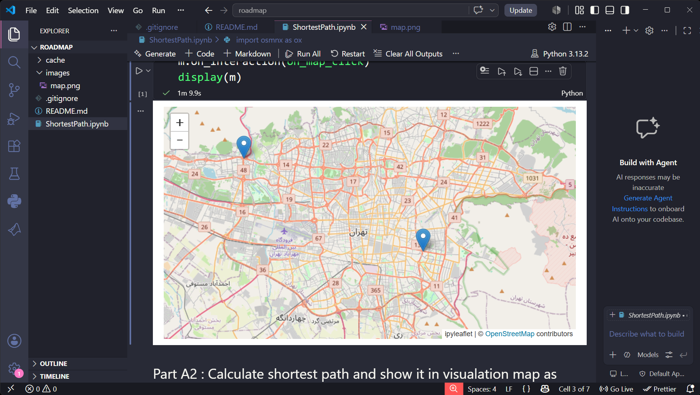
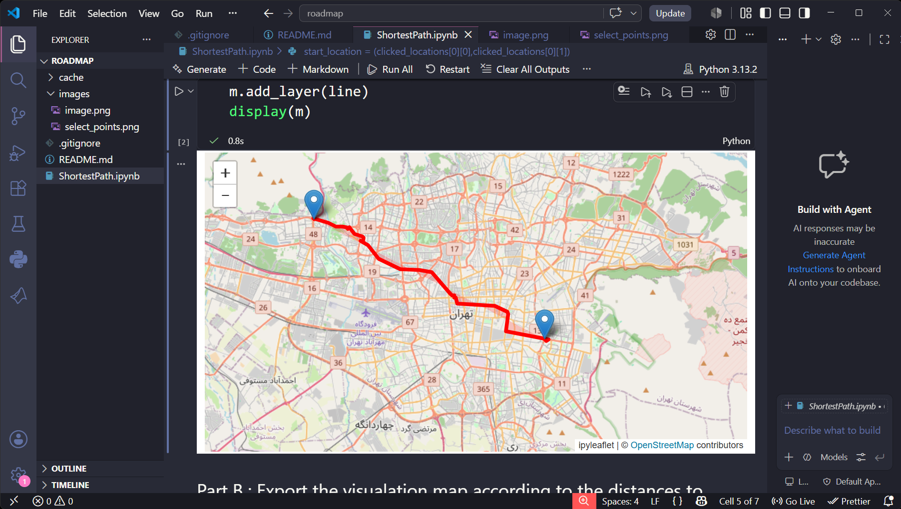
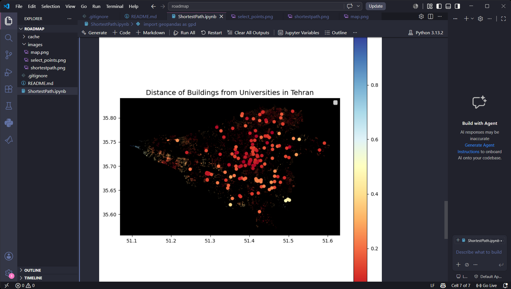

# 🗺️ Shortest Path on Tehran Road Network

An interactive Geographic Information System (GIS) project that computes and visualizes the shortest path between two user-selected locations in Tehran using real-world road network data from OpenStreetMap.

The project combines graph algorithms with spatial data analysis to demonstrate how road networks can be modeled as graphs and how shortest paths can be efficiently computed.

---

## 📌 Features

- 🌍 Download Tehran road network from OpenStreetMap
- 📍 Interactive map for selecting origin and destination
- 🛣️ Compute the shortest driving path using graph algorithms
- 📡 Find the nearest road nodes automatically
- 🗺️ Visualize the computed route on an interactive map
- 🏫 Extract universities and buildings from OpenStreetMap
- 📊 Perform basic geographic and spatial analysis
- 📍 Display geographic layers using GeoPandas and ipyleaflet

---

# 🖼️ Demo

### Interactive Map

> Replace the image below with a screenshot of the initial interactive map.

<p align="center">

</p>

---

### Selecting Start and Destination

> Screenshot showing two selected locations.

<p align="center">

</p>

---

### Shortest Path Result

> Screenshot after computing the shortest route.

<p align="center">

</p>

---

## ⚙️ Technologies

| Category | Tools |
|----------|------|
| Language | Python |
| GIS | OSMnx, GeoPandas, Shapely |
| Graph Algorithms | NetworkX |
| Visualization | ipyleaflet, Matplotlib |
| Data Source | OpenStreetMap |

---

# 📖 How It Works

The workflow of the project is illustrated below.

```
OpenStreetMap
       │
       ▼
Download Tehran Road Network
       │
       ▼
Convert Roads into Graph
       │
       ▼
User Selects Two Locations
       │
       ▼
Find Nearest Graph Nodes
       │
       ▼
Run Shortest Path Algorithm
       │
       ▼
Visualize Route on Map
```

---

## 🚀 Workflow

### 1. Load Road Network

The road network of Tehran is downloaded directly from OpenStreetMap using **OSMnx**.

---

### 2. Select Locations

The user clicks on the map to choose the origin and destination.

---

### 3. Convert Coordinates

Selected coordinates are mapped to the closest nodes of the road graph.

---

### 4. Compute Shortest Path

The shortest path between the two graph nodes is computed using **NetworkX**.

---

### 5. Visualization

The resulting path is displayed interactively on the map.

---

### 6. Spatial Analysis

Additional OpenStreetMap layers such as:

- Universities
- Buildings

are extracted for geographic analysis and visualization.

---

# 📂 Project Structure

```
ShortestPath.ipynb
```

---

# 🎯 Applications

- Geographic Information Systems (GIS)
- Navigation Systems
- Smart City Applications
- Route Planning
- Transportation Analysis
- Graph Theory Education
- Spatial Data Visualization

---

# 📚 Concepts Used

- Graph Theory
- Shortest Path Algorithms
- Geographic Information Systems (GIS)
- Spatial Data Processing
- Interactive Mapping
- OpenStreetMap API
- Graph Visualization

---

# 💡 Future Improvements

- Convert notebook into a standalone Python application
- Build a web interface with Streamlit or Flask
- Support multiple transportation modes
- Add A* search algorithm for comparison
- Display travel distance and estimated time
- Optimize route computation for larger maps

---

# ⭐ Example Output

The application allows users to interactively select two locations on Tehran's road network and immediately visualize the shortest route computed over real-world street data.

> Replace this section with your final output screenshot.

<p align="center">

</p>

---

# 📜 License

This project is intended for educational and research purposes.